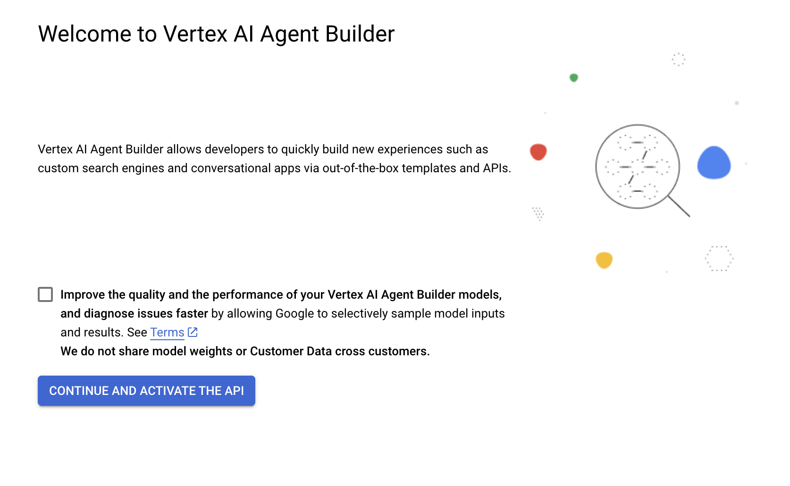
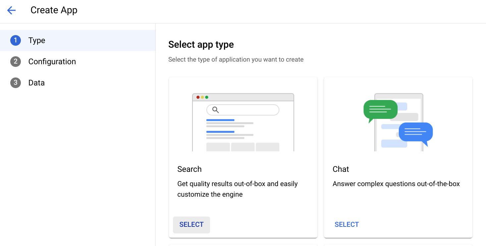
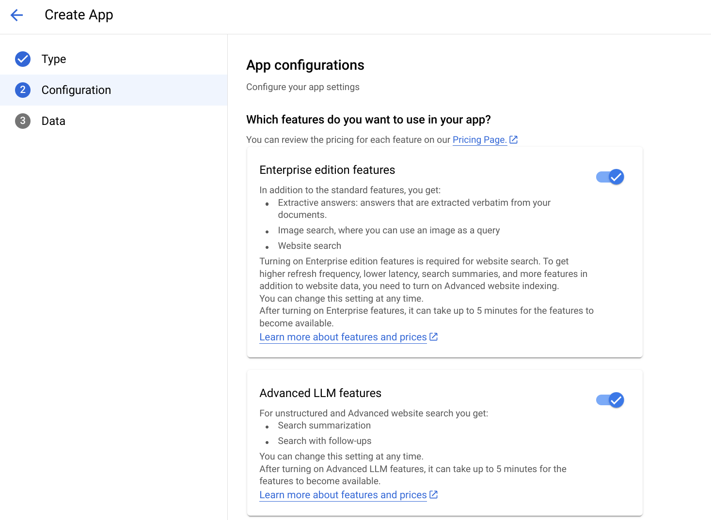
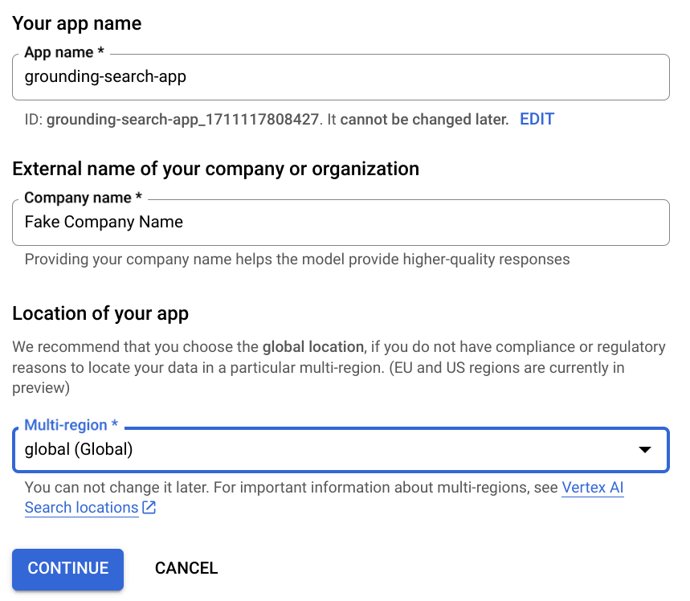
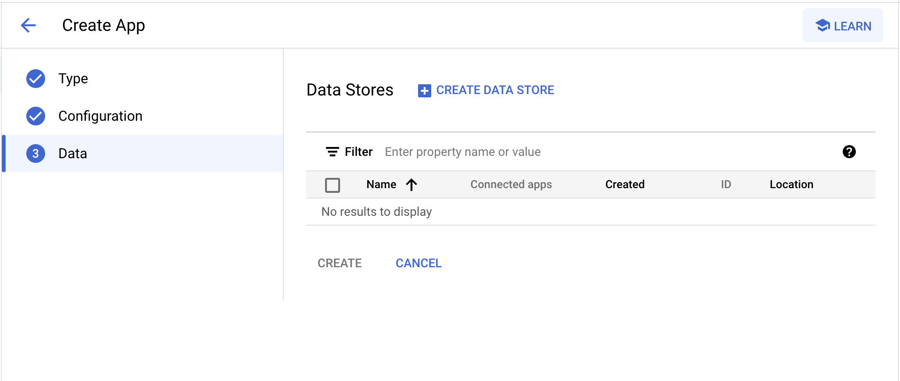
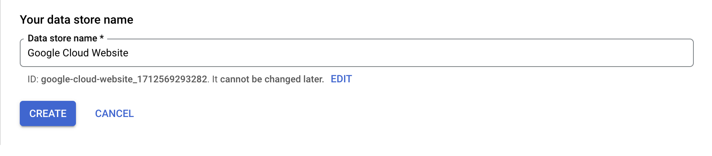
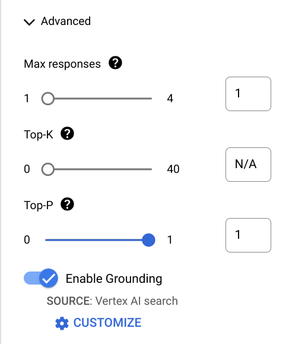
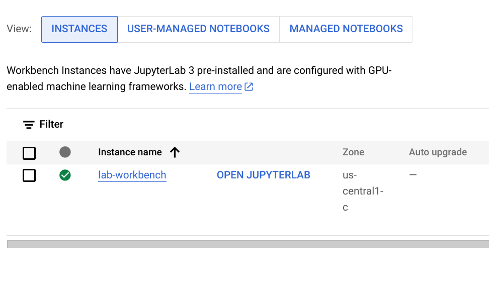

# Search and Grounding with Vertex Agent Builder

## CE110

![[/fragments/labmanuallogo]]

## Overview

Enterprise Search on Vertex AI Agent Builder (Agent Builder) brings together the power of deep information retrieval, state-of-the-art natural language processing, and the latest in large language processing to understand user intent and return the most relevant results for the user.

In this lab you will learn how to create a search application based on:
* websites
* structured data
* unstructured data

then configure, visualize, and analyze the search results that are returned from the search app.


## Objectives

In this lab, you will learn how to perform the following tasks:

- Create and use a data store in Vertex AI Search to ground responses in custom documents and data
- Generate LLM text and chat model responses grounded in Vertex AI Search results in Vertex AI Studio
- Generate LLM text and chat model responses grounded in Vertex AI Search results using the Python SDK


## Setup and requirements

![[/fragments/startqwiklab]]

![[/fragments/gcpconsole]]


## Task 1. Enable APIs for Vertex AI Agent Builder

1. In the Google Cloud console, from the Navigation menu, select __Agent Builder__ from the __Artificial Intelligence__ section.

2. You might see a welcome screen with the title **Welcome to Vertex Al Agent Builder**. Click on the **Continue and activate the API** button.



<ql-infobox>
<strong>Note:</strong> You are directed to the <strong>Create app</strong> wizard in Vertex AI Agent Builder.
</ql-infobox>

## Task 2. Create a search app for website data

In this task, you create a search app in Vertex AI Search. This search app will be used to ground LLM responses in later tasks. If you navigated away from the **Create app** wizard in Vertex AI Agent Builder, return to the Navigation menu on the top left of the console and navigate to **Agent Builder** and then click **Create a new app**.

1. In the **Type** pane, select **Search**. If you are offered a choice of generic or media content, click **Generic**.



2. Ensure that both **Enterprise features** and **Advanced LLM features** are enabled for your app.



3. Scroll down to see additional fields. In the **Your app name** field, enter `grounding-search-app`.

4. In the **External name of your company or organization** field, enter `Fake Company Name`.

5. Select **global (Global)** as the location for your app, and then click **Continue**.



6. In the **Data stores** pane, click **Create data store**.



7. In the **Select a data source** pane, select **Website URLs**. Then make sure that **Advanced website indexing** is turned off.

8. Under **Specify URL patterns to index** pane, in the **Sites to include** field, enter `cloud.google.com/*` and then click **Continue**.

9. In the **Configure your data store** pane, enter `Google Cloud Website` as the name for your data store. Record your data store ID somewhere easily accessible (of the form `google-cloud-website_<some-numbers>`) as you will need it in later steps.



10. Click **Create** to create your data store.

11. On the **Data stores** page select your `Google Cloud Website` datastore and then click **Create**.

## Task 3. Create and Preview an unstructured data search app

Unstructured data is data that does not have a predefined format. This type of data can be difficult to search for using traditional search engines. An unstructured data search app can be used to make this data more accessible to use and gain insights that can be used to improve business operations.

1. From the __Navigation Menu__ go to __Agent Builder__.

2. Click __+CREATE APP__.

3. On the __Create App__ page, make sure __Search__ is selected, for __Your app name__ and __Company Name fields__ enter:
   
```
Alphabet Investor PDFs
```

Then click __Continue__.

4. On the __Select a data store__ for your app page, click __+CREATE DATA STORE__ then select __Cloud Storage__ as data source.

5. In the __Import data from Cloud Storage__ pane, enter the following value:

```
cloud-samples-data/gen-app-builder/search/alphabet-investor-pdfs
```

This Cloud Storage bucket contains earnings report PDFs from the [Alphabet investor site](https://abc.xyz/).

6. Make sure to select __Unstructured documents__ and then click __CONTINUE__.

7. On the __Configure your data store__ page, in the __Data store name__ field, enter: 

```
Unstructured data
```

Then, click the  __DOCUMENT PROCESSING OPTIONS__ drop down menu. In the now visible __Default Document Parser__ drop down menu, select __Layout Parser__ and also check the  __include ancestor headings in chunks__ box then click __CREATE__.

8. On the __Data__ page for your app, select __Unstructured data__ then click __CREATE__.

9. Click __ACTIVITY__.

`Import completed` displays in the __Status__ column when the import process is finished. You might need to click __Refresh__ to see `Import completed`.

<ql-infobox><b>Note: </b>It may take a few minutes to index all of the unstructured data found in the PDF documents before completing the section below. You may choose to run the Activity Tracking step below or end the lab if desired.</ql-infobox>

10. Click the __DOCUMENTS__ tab to see the number of documents imported.


## Task 4. Exploring grounding in Vertex AI Studio

In this task you use the search app you just created in Vertex AI Search to ground the `text-bison` model to answer a question about BigQuery object tables and observe the improvement in model performance that comes from grounding.

1. In the Google Cloud console, from the Navigation menu, select __Vertex AI__ from the __Artificial Intelligence__ section.

2. In the __Tools__ pane on the left, click __Language__ from the __Vertex AI Studio__ section.

3. Under __Create a new prompt__, click __Text Prompt__ on the **Get Started** page.

4. On the right side of the console, in the **Model** dropdown, select `gemini-flash1.5-001`. You will be comparing responses from our latest, fastest Gemini model version before and after using grounding.

5. In the Prompt box type the following. and click __Submit__. Read the response.

```
When should I use an object table in BigQuery? And how does it store data?
```

Note that the response without grounding only has limited information from the LLM about object tables in BigQuery that might not be accurate. Object tables let you analyze unstructured data stored in Cloud Storage, but the response focuses on structured data.

Grounding can be used to ensure that the model has access to the most up to date information from the Google Cloud documentation.

6. On the right side of the console, scroll down and expand the **Advanced** tab underneath the **Safety filter threshold** dropdown menu.

7. Scroll down until you see **Enable Grounding** and ensure that this feature is enabled.



8. Click on the **Customize** button. Under **Grounding source** select **Vertex AI Search** and then copy and paste the following data store path, replacing `YOUR_DATA_STORE_ID` with the ID of your data store you recorded earlier. Click __Save__.

    <ql-code-block noWrap templated>
    projects/{{{project_0.project_id|project_id}}}/locations/global/collections/default_collection/dataStores/YOUR_DATA_STORE_ID
    </ql-code-block>

9. In the Prompt box retype the following prompt if necessary and click __Submit__. Read the response.

    ```
    When should I use an object table in BigQuery? And how does it store data?
    ```

Note that the response with grounding contains more factual information about object tables than the ungrounded response. 

10. Click __Save__ in the top-right corner. In the __Save Prompt__ pop-up, leave the region as default and click __Save__.

## Task 5. Exploring grounding using the Vertex AI Client Library

In this task, you now explore the use of the Vertex AI Python SDK to implement grounding for the `text-bison` and `chat-bison` models in a Jupyter notebook environment.

1. In the Google Cloud console, using the navigation menu, Navigate to **Vertex AI** and then select **Workbench**. Open the **Instances** tab if it is not already available.

2. The lab automatically spins up a notebook called __lab-workbench__ for you. Click **Open JupyterLab** to access the JupyterLab environment.



3. Click on **Open from URL**, and paste the following URL to open the notebook.

    <ql-code-block noWrap>
   https://raw.githubusercontent.com/GoogleCloudPlatform/generative-ai/main/gemini/grounding/intro-grounding-gemini.ipynb.
    </ql-code-block>

4. From inside the notebook, click **Edit > Clear All Outputs**.

5. Carefully read through the notebook instructions and **run the cells in order**. Ignore any references to **Allowlisting** of features, you should have access to all that are needed. 

**Tip:** To run the current cell, click the cell and press SHIFT+ENTER. Other cell commands are listed in the notebook UI under **_Run_**.

6. Once you have run through all of the cells, repeat them changing the model to use 'gemini-1.5-flash-001' instead of 'gemini-1.5-pro-001'. You will see both faster response times as well as less verbosity. 

7. Repeat yet again, replacing the **datastore_id** vacriable value in the notebook with the ID of your **unstructured data** data store. For this, also replace the **prompt** with **'how much did Google revenue grow between 2008 and 2020?'**.

## Congratulations!

You have successfully completed this lab! You created a Vertex AI Search app and used it to ground your LLM responses in Vertex AI Studio and using the Vertex AI Python SDK.


### Next steps
* Learn more about Vertex AI on the [Google Cloud Tech YouTube channel](https://www.youtube.com/@googlecloudtech/).


![[/fragments/TrainingCertificationOverview]]


**Manual Last Updated May 23, 2024**

**Lab Last Tested May 23, 2024**

![[/fragments/copyright]]  
